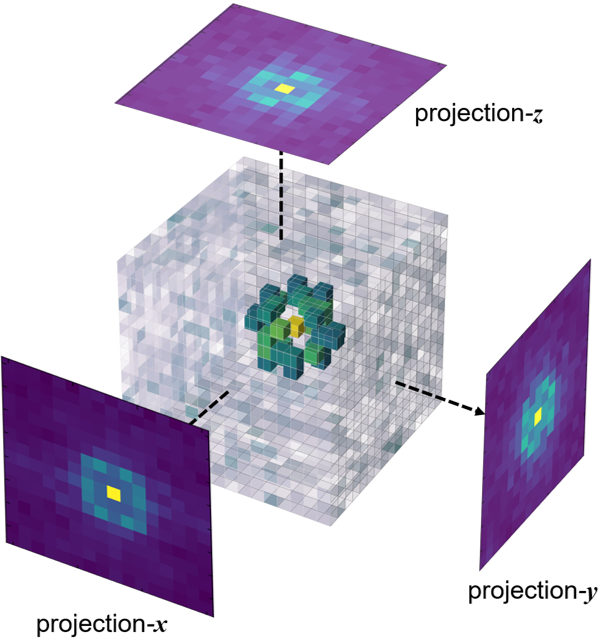

# FTCNN

## § Introduction
This project utilizes a simple 3D-CNN for accurate morphology detection of self-assembling amphiphilic molecules formed in molecular simulations. First, Point clouds generated from simulation frames are voxelized into occupancy grids. Then discrete Fourier transformation (DFT) is implemented on the voxels using FFT algorithm to obtain input data. FTCNN is advantageous over the PointNet implementation from the earlier paper "[Development of a PointNet for Detecting Morphologies of Self-Assembled Block Oligomers in Atomistic Simulations](https://doi.org/10.1021/acs.jpcb.1c02389)" in three ways:
 - Much simpler model architecture, and much less parameters
 - Translational invariance is built in by definition of Fourier transform
 - Not restricted by the system size (number of points per point cloud) and characteristic dimension of the morphology (domain spacing / box dimension)
 
### FTCNN architecture
<p align="center">

</p>

### 3-D visualization of a Fourier-transformed voxel for a double gyroid point cloud
<p align="center">
  
</p>

### Representative x-, y-, z- projections of the Fourier-transformed occupancy grids for different morphologies
<p align="center">

</p>

## § Data Downloads

Available soon.

## § Usage
To preprocess:

  ```sh
  python preprocess.py --raw_path /path/to/raw/data --proc_path data/dataset_name.h5 -r resolution 
  ```
To train:

  ```sh
  python train.py --proc_path data/dataset_name.h5 --save_path cls/model_state_name.pth -n num_epochs -b batch_size
  ```
## § Contributing

Contributions are what make the open source community such an amazing place to be learn, inspire, and create. Any contributions you make are **greatly appreciated**.

1. Fork the Project
2. Create your Feature Branch (`git checkout -b feature/AmazingFeature`)
3. Commit your Changes (`git commit -m 'Add some AmazingFeature'`)
4. Push to the Branch (`git push origin feature/AmazingFeature`)
5. Open a Pull Request

Project Link: [https://github.com/donshen/FTCNN](https://github.com/donshen/FTCNN)

