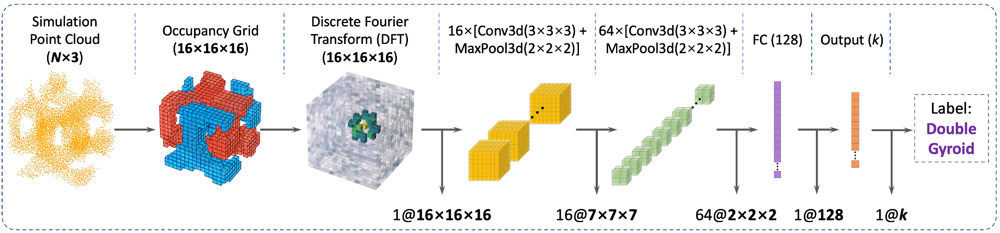
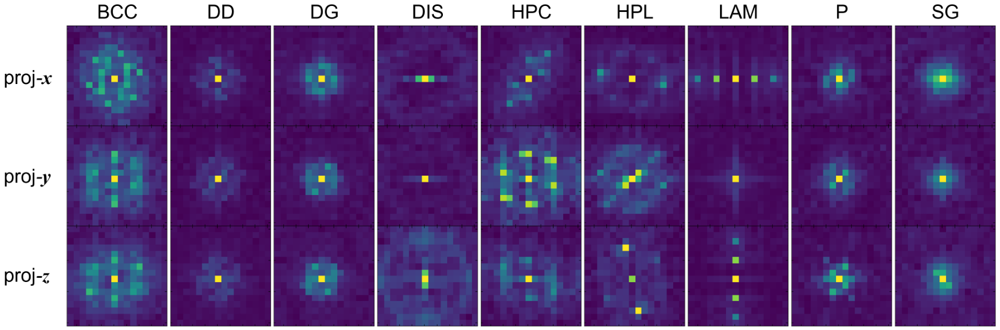

# FTCNN
CNN for structure classification through Fourier Transform of voxelized point clouds








To preprocess:

    ```sh
    python preprocess.py --raw_path /path/to/raw/data --proc_path data/dataset_name.h5 -r resolution 
    ```
To train:

    ```sh
    python train.py --proc_path data/dataset_name.h5 --save_path cls/model_state_name.pth -n num_epochs -b batch_size
    ```

